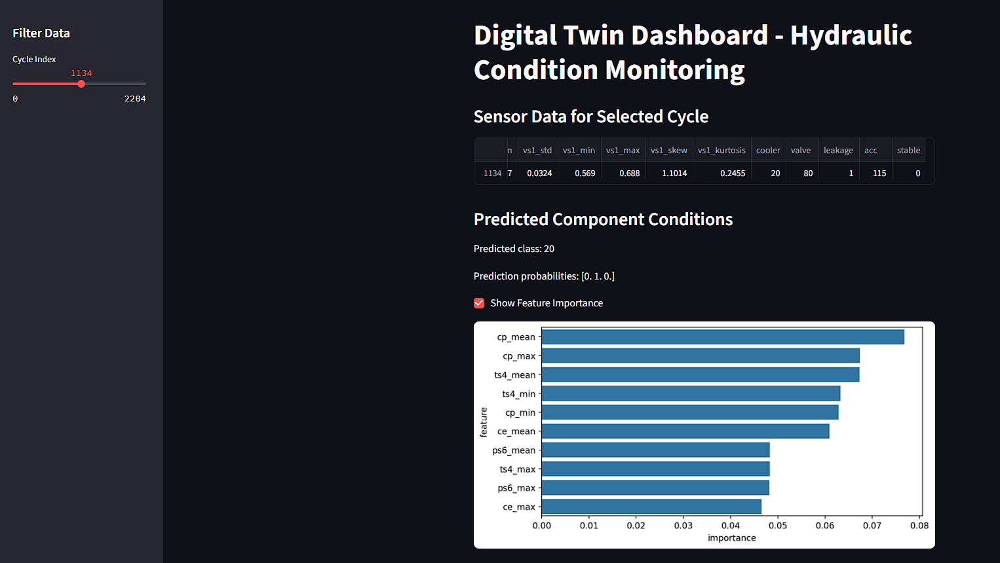

# Digital Twin: Hydraulic System Monitoring Dashboard

This project demonstrates how to build a machine learning-based **Digital Twin** for condition monitoring of a complex hydraulic system using real-world multi-sensor data.

## Objective

Predict the health status of components like:
- **Pump**
- **Valve**
- **Cooler**
- **Accumulator**

...using data from:
- Pressure, temperature, flow rate, motor power, vibration, etc

## Dataset

**Source**: UCI Machine Learning Repository  
**Link**: [Condition monitoring of hydraulic systems](https://archive.ics.uci.edu/ml/datasets/Condition+monitoring+of+hydraulic+systems)

**Size**: ~530MB  
**Format**: 1 file per sensor (e.g., PS1.txt, FS1.txt, etc.)

The `profile.txt` file contains the cycle-wise label (target conditions).

## Workflow

### 1. Preprocessing & Feature Engineering
- Read all sensor `.txt` files into pandas
- Aggregate signals into statistical features per cycle
- Merge with `profile.txt` (target labels)
- Encode labels & save final dataset

### 2. Modeling
- Classification task (multiclass)
- Models used:
  - RandomForestClassifier
  - XGBoost
- Evaluation: Confusion Matrix, Classification Report

### 3. Feature Importance
- Based on model feature importances
- Used for dashboard insight display

### 4. Interactive Dashboard (Streamlit)
- Visualize sensor data and prediction for each cycle
- Display predicted component condition
- Show top feature contributions

## Project Structure

```
digital-twin
│
├── data/ # Cleaned & engineered data
├── models/ # Trained ML model (pickle)
├── src/ # Preprocessing & inference scripts
├── app/ # Streamlit app
├── notebooks/ # EDA & modeling
├── requirements.txt
└── README.md
```


## How to Run

1. Clone the repo  
```bash
git clone https://github.com/yourusername/digital-twin-dashboard
cd digital-twin-dashboard
```

2. Install dependencies
```bash
pip install -r requirements.txt
```

3. Run the dashboard
```bash
cd app
streamlit run app.py
```

## Sample Dashboard Screenshot



## Citation
If using this dataset, please cite:
Nikolai Helwig, Eliseo Pignanelli, Andreas Sch�tze, �Condition Monitoring of a Complex Hydraulic System Using Multivariate Statistics�, in Proc. I2MTC-2015 - 2015 IEEE International Instrumentation and Measurement Technology Conference, paper PPS1-39, Pisa, Italy, May 11-14, 2015, doi: 10.1109/I2MTC.2015.7151267.